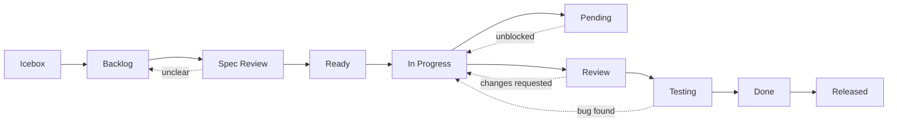

# Status Options Reference

## Workflow Diagram

## Status Definitions

| Status | Color | Purpose | Next Status |
|--------|-------|---------|-------------|
| Icebox | Gray | Ideas for future consideration | Backlog |
| Backlog | Blue | Prioritized work items | Spec Review |
| Spec Review | Pink | Requirements/specs under review | Ready / Backlog |
| Ready | Green | Ready to start, dependencies resolved | In Progress |
| In Progress | Yellow | Actively being worked on (1 per person) | Review / Pending |
| Pending | Red | Temporarily blocked (reason required) | Original status |
| Review | Purple | Awaiting PR review | Testing / In Progress |
| Testing | Orange | QA/testing in progress | Done / In Progress |
| Done | Green | Completed and merged | Released |
| Released | Green | Deployed to production | - |

## Usage Examples

### Icebox

| When to use | Example |
|-------------|---------|
| Just thought of an idea | "Want dark mode support" |
| Future consideration | "Consider for v2.0" |
| Low priority | "nice-to-have feature" |

### Pending

| When to use | Example |
|-------------|---------|
| Waiting for other task/PR | "Waiting for #123 to merge" |
| Waiting for external response | "Waiting for client confirmation" |
| Technical blocker | "Reported library bug" |

**Important**: Always document the blocking reason in comments.
